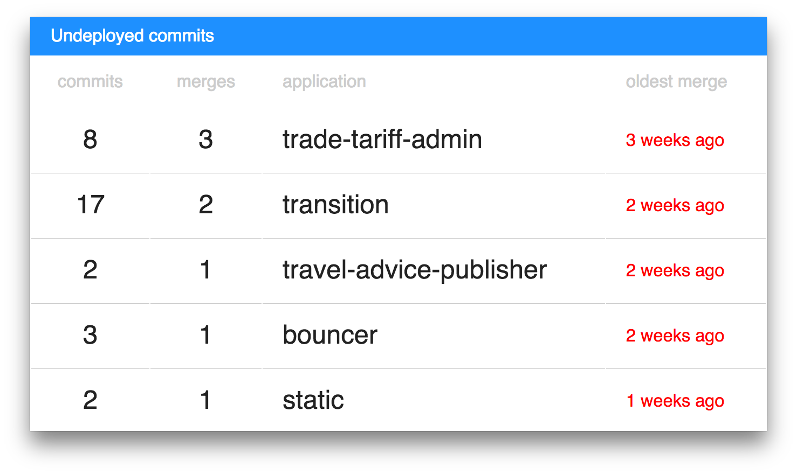

# Deploy Lag Radiator

A _information radiator_ / _glancable_ / _stats screen_ to show how far a repo is behind it's latest deployed version.

It relies on a consistent tag/branch which tracks the latest deployed version and compares that to HEAD on master (though you can choose a different point).

It's intended to highlight changes that may sit undeployed for a long time, causing a build up of deployment risk.

## Config

Pass configuration as query params, supported params are;

| Key | Usage | Required? |
| --- | ----- | --------- |
| `token` | A Github API token, otherwise you may be rated limited by the API. You can get one by [creating a personal access token](https://github.com/settings/tokens/new) with the `public_repo` scope.  | No |
| `repos` | A comma-seperated list of repository names, either `owner/repo-name` or `repo-name` (the later requires an `owner` value to be set) | Yes |
| `owner` | A Github user, or orgnanisation, used for `repos` that don't specify one. | No |
| `refresh` | How often to update, in seconds | No, default `60` |
| `from` | A treeish (tag, branch, etc) to start comparing from | |
| `to`  | A treeish (tag, branch, etc) to compare until | No, defaults to `master` |
| `resolve_tags` | Set this to anything truthy (ie not an empty string) to look up tags for the `from` and `to` commits to use in the title compare link | |
